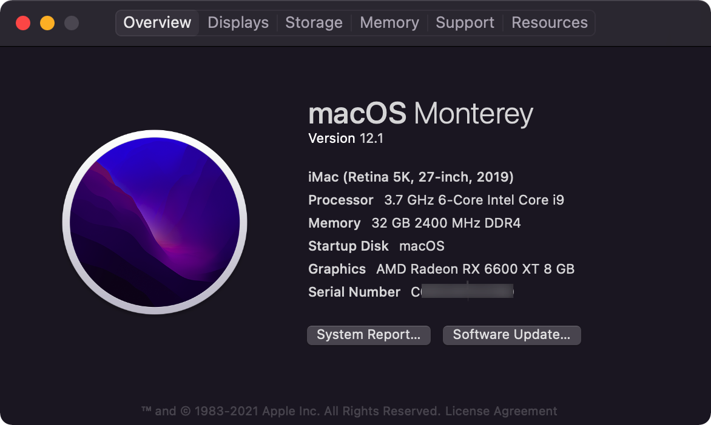

Hackintosh EFI by OpenCore

### Hardware
|  |    |
| ---------- | -------------            | 
|CPU      | i5-9600K             | 
| Mainboard     | Gigabyte z390m | 
| GraphicCard     | Sapphire Rx 6600xt OC  |
| Wifi&BT | FV T919 bcm94360cd  | 
| Memory     | Kingston 16G 3200  | 
| Disk     |  M.2 1T          |

### Versions
- OpenCore 0.7.4 (tag v0.7.4)

### macOS monterey

